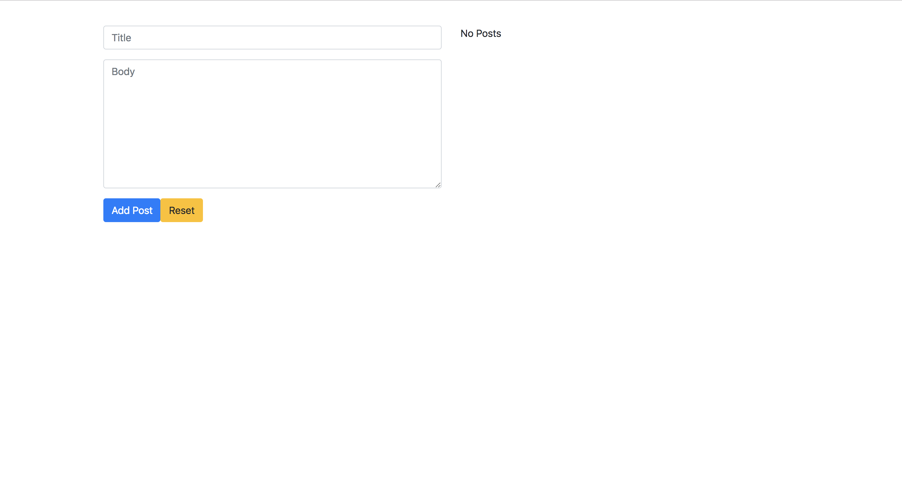

This is a simple React/Redux application where users can create and delete posts which are connected to a MongoDB. This application is also styled with Bootstrap.

Installation Instructions

1. Clone Repo
2. CD into directory
3. Install dependancies
4. CD into src and run yarn start
5. Open new terminal and CD into server and run nodemon
6. Go to localhost:3000 to use application

